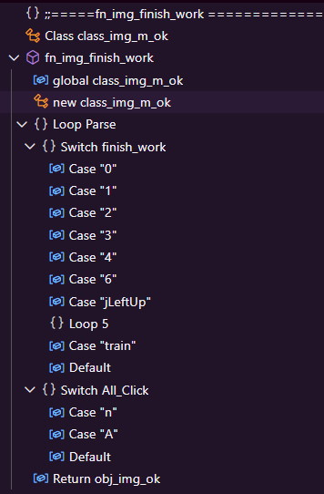

# vscode-autohotkey-Outline

> Base of [cweijan /vscode-autohotkey](https://github.com/cweijan/vscode-autohotkey)

my telegram <https://t.me/ceenekomimi>

AutoHotKey language support for VS Code

- [vscode-autohotkey-Outline](#vscode-autohotkey-outline)
  - [MethodSymbol](#methodsymbol)
  - [CodeSymbol](#codesymbol)
  - [GotoDefinition](#gotodefinition)
  - [CodeFormat](#codeformat)

## MethodSymbol

1. Detect source method as symbol
2. You can add a `;@ comment` to the method using a semicolon on the previous line of the method.
3. Now you can see "Splitting a Long Line into a Series of Shorter Ones" at Outline.

   
   

## CodeSymbol

1. You can add two semicolon `;;` to comment line
   or add `{ ;;` to comment code block.

   

2. You can see Leveled outline

- function
- for
- class
- loop
- switch

  

1. Better view

- Static Var
- Return
- Case
- Default
- GoSub
- GoTo
- Label
- New
- HotString, like `::ahk,,::AutoHotkey`
- HotKeys, like `~F12::`
- directive, like `#Include or #Warn`
- Global
- Throw

  

## GotoDefinition

1. Press ctrl and move the mouse coordinates to the calling code
   

## CodeFormat

1. Right click then click format document.

- **Formatter follows my coding habits, so it may not unsuited for you**.
- my style fork is not Formatter Label and Return.
