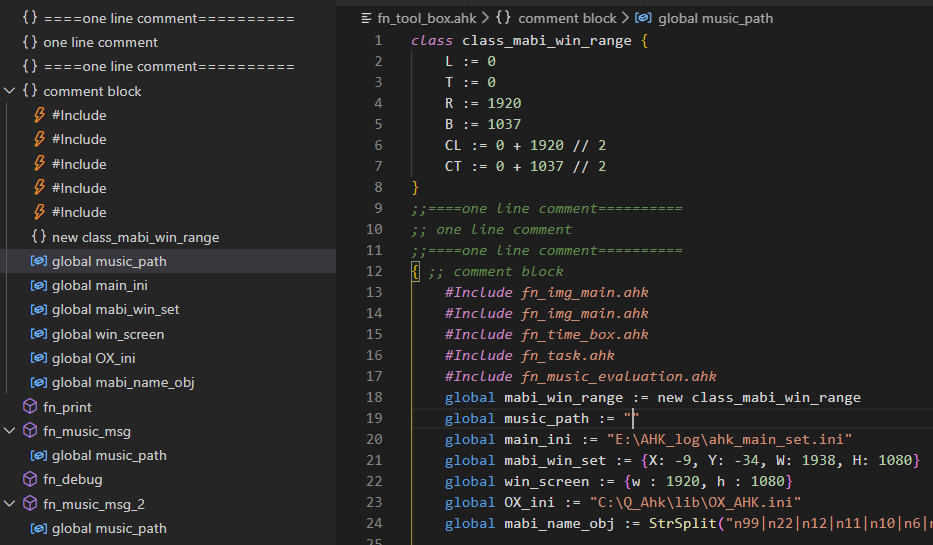
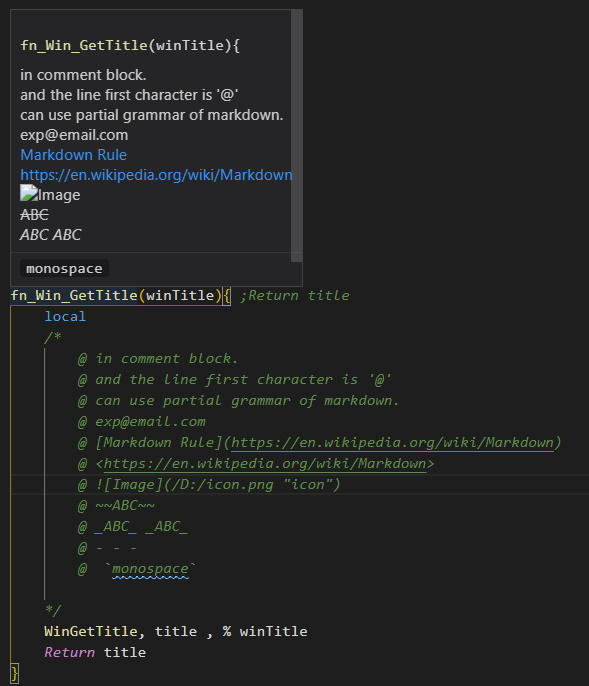
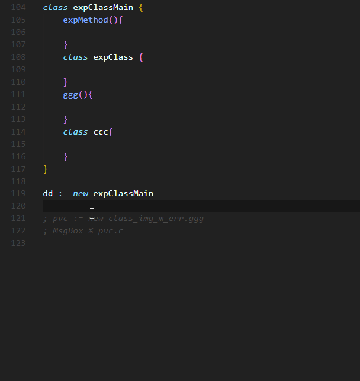

# vscode-autohotkey-Outline

> Base of [cweijan /vscode-autohotkey](https://github.com/cweijan/vscode-autohotkey)

AutoHotKey language support for VS Code

-   [vscode-autohotkey-Outline](#vscode-autohotkey-outline)
    -   [CodeSymbol](#codesymbol)
    -   [GotoDefinition](#gotodefinition)
    -   [Hover](#hover)
    -   [CodeFormat](#codeformat)
    <!-- -   [IntelliSense](#IntelliSense) -->

## MethodSymbol

1. Detect source method as symbol
2. Now you can see "Splitting a Long Line into a Series of Shorter Ones" at Outline.

## CodeSymbol

1. You can add two semicolon `;;` to comment line
   or add `{ ;;` to comment code block.

    

2. You can see Leveled outline

-   function
-   class
-   switch
<!-- -   for
-   loop -->
-   Static Var
-   Return
-   Case, Default
-   GoSub, GoTo
-   Labels, like `this_is_a_label:`
-   New
-   HotString, like `::ahk::`
-   HotKeys, like `~F12::`
-   directive, like `#Include` or `#Warn`
-   global
-   Throw
-   Reload, Exit, ExitApp, Pasue
    

## GotoDefinition

1. Go to Definition (via `F12` or `Ctrl+Click`)
2. open the definition to the side with ( via `Ctrl+Alt+Click` )
3. Peek Definition (via `Alt+F12`)
4. List all references
   
      <!-- 5. Go to References search (via Shift+F12) -->

## Hover

1. Hover function to show return value or comment

    
    

2. how to add comment of function ?

```ahk
/*
    @ in comment block.
    @ and the line first character is '@'
    @ can use partial grammar of markdown.
    @ exp@email.com
    @ [Markdown Rule](https://en.wikipedia.org/wiki/Markdown)
    @ <https://en.wikipedia.org/wiki/Markdown>
    @ 
    @ ~~ABC~~
    @ _ABC_ _ABC_
    @ - - -
    @  `monospace`
*/
```

## CodeFormat

1. Right click then click format document.
2. or `alt` + `shift` + `f`

-   **beta test now.**

<!-- ## IntelliSense

 -->
